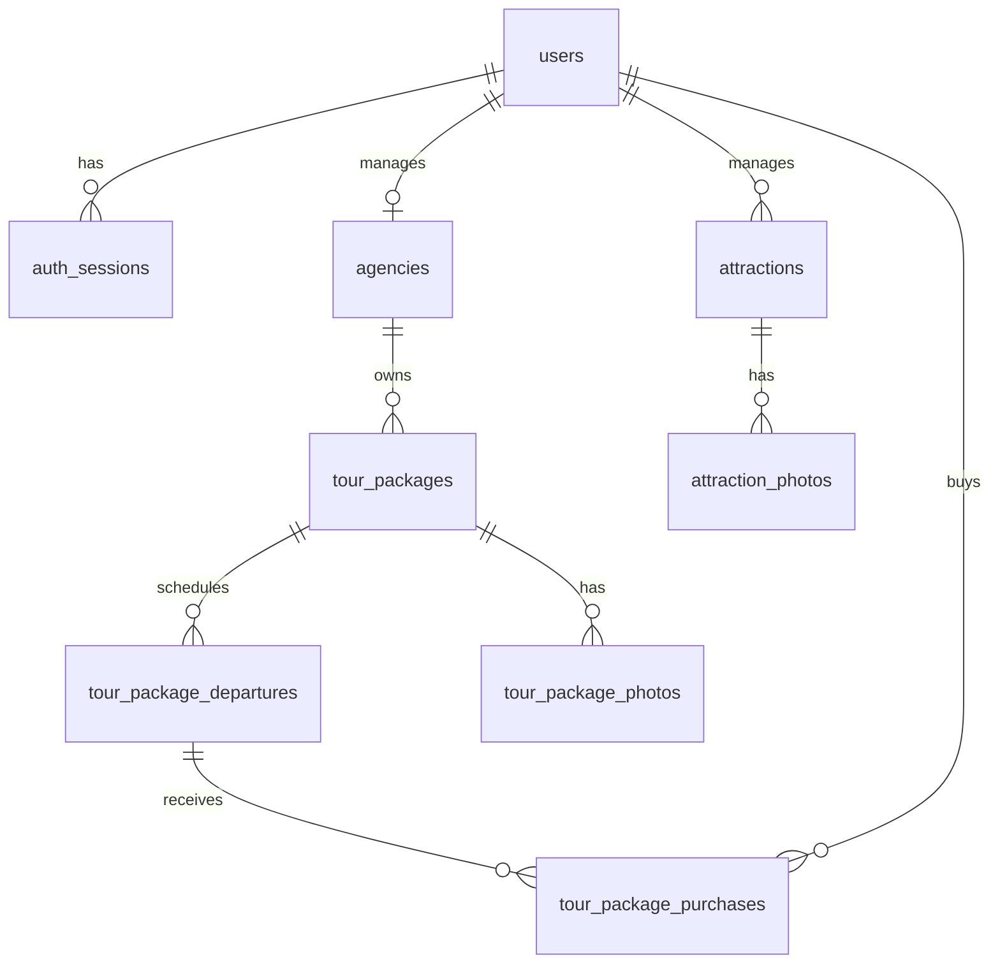

# Auditoría técnica de Andaria — versión reducida para el diplomado

> Documento histórico del corte `f1bec3b`, inspeccionado el 28/09/2026. Sus referencias a Flutter o CI como ausentes describen ese corte, no el estado actual. La implementación móvil y sus límites se documentan en [App Android](docs/app-android.md).

Fecha de inspección: 28 de septiembre de 2026. Corte de código: `f1bec3b` en `main`. Método: lectura de archivos y Git locales; no se ejecutó el servidor, no se consultó la base en vivo, no se instalaron dependencias ni se corrieron pruebas. Los resultados de pruebas previos se citan como documentación histórica, no como verificación de esta auditoría.

**Convención de evidencia.** `CONFIRMADO EN CÓDIGO`, `CONFIRMADO EN CONFIGURACIÓN`, `CONFIRMADO EN GIT`, `INFERIDO` y `NO ENCONTRADO` se usan en sentido literal. Por instrucción del propietario, todo módulo ausente de esta versión se clasifica documentalmente como **MÓDULO ELIMINADO POR REDUCCIÓN DEL SISTEMA**. Esa clasificación no demuestra que hubiera existido antes: para una afirmación histórica sobre su eliminación haría falta el repositorio previo. Una función presente en código puede estar fuera de alcance académico.

## Índice

1. Resumen ejecutivo
2. Estructura del proyecto
3. Stack y versiones
4. Arquitectura
5. Backend
6. API
7. Base de datos
8. Roles y permisos
9. Seguridad
10. Plataforma web
11. Aplicación Flutter
12. Integración multiplataforma
13. Reservas
14. Pagos
15. Reportes
16. WebSocket y notificaciones
17. Archivos e imágenes
18. Pruebas
19. Despliegue
20. Git
21. Dificultades técnicas
22. Funcionalidad legacy
23. Inconsistencias
24. Información pendiente
25. Respuestas a las 50 preguntas clave

## 1. Resumen ejecutivo

**CONFIRMADO EN CÓDIGO/CONFIGURACIÓN:** hay una aplicación web Nuxt, API HTTP JSON Go y esquema PostgreSQL mediante 12 migraciones SQL. El flujo comercial se denomina **compra de cupos de una salida**: recibe comprobante, retiene cupos y solicita revisión humana del pago. QR y transferencia son medios configurados por la agencia, sin integración bancaria en las rutas o dependencias presentes. **NO ENCONTRADO:** aplicación Flutter, promociones, módulo autónomo de reservas, pasarela automática, WebSocket, notificaciones, reportes exportables y publicación real. Conforme a la instrucción del propietario, estos módulos ausentes se documentan como **eliminados por reducción del sistema**; Flutter además figura como etapa posterior en `docs/alcance-acordado.md:3` y `docs/auditoria-integral.md:42`. **CONFIRMADO EN CÓDIGO:** itinerarios existen dentro de paquetes, pero se clasifican **FUNCIONALIDAD LEGACY / FUERA DEL ALCANCE ACTUAL DE LA MONOGRAFÍA** (`backend/internal/database/migrations/000007_tour_packages.sql:35-53`, `frontend/pages/packages/[id].vue:27`).

Registro de hallazgos auditables para los recuentos finales:

| ID | Estado | Hallazgo | Evidencia principal |
|---|---|---|---|
| H01 | Confirmado | Un repositorio contiene web y API | `frontend/`, `backend/`, `.git` raíz |
| H02 | Confirmado | API Go con Gorilla Mux | `backend/go.mod:1-14`, `backend/internal/httpapi/router.go:17-34` |
| H03 | Confirmado | Nuxt/Vue/Pinia | `frontend/package-lock.json`, `frontend/nuxt.config.ts:12-19` |
| H04 | Confirmado | PostgreSQL con GORM y migraciones SQL | `backend/internal/database/database.go:15-35`, `migrate.go:14-65` |
| H05 | Confirmado | Cuatro roles | `backend/internal/models/user.go:5-9` |
| H06 | Confirmado | Sesión opaca en cookie y BD | `backend/internal/handlers/auth.go:237-285`, `middleware/auth.go:35-90` |
| H07 | Confirmado | Caducidad absoluta e inactiva | `backend/internal/config/config.go:70-79`, `middleware/auth.go:67-87` |
| H08 | Confirmado | Contraseñas bcrypt | `backend/internal/security/password.go:15-30` |
| H09 | Confirmado | Protección CSRF y CORS | `backend/internal/middleware/auth.go:43-53`, `cors.go:9-18` |
| H10 | Confirmado | 75 registros de rutas, contando `/health` | `backend/internal/httpapi/router.go:32-134` |
| H11 | Confirmado | Gestión de agencias por propietario | `backend/internal/handlers/agency.go:138-159`, `package.go:94-101` |
| H12 | Confirmado | Atracciones con mapa y fotos | `backend/internal/handlers/attraction.go:202-253`, `frontend/components/attractions/LocationMap.client.vue:17-67` |
| H13 | Confirmado | Paquetes con salidas y cupos | migraciones `000007` y `000008` |
| H14 | Confirmado | Compra con retención transaccional | `backend/internal/handlers/purchase.go:183-286` |
| H15 | Confirmado | Pago de revisión humana | `backend/internal/handlers/purchase.go:725-809` |
| H16 | Confirmado | Cancelación y reembolso con comprobante | `backend/internal/handlers/purchase.go:495-652` |
| H17 | Confirmado | Paneles de cifras por rol | `backend/internal/handlers/dashboard.go:25-164`, `admin.go:23-49` |
| H18 | Confirmado | Fotografías y comprobantes en BYTEA | migraciones `000003`, `000004`, `000007`, `000010`, `000012` |
| H19 | Confirmado | Docker Compose y Nginx configurados | `docker-compose.prod.yml:1-145`, `nginx/default.conf:1-82` |
| H20 | Confirmado | 20 archivos de prueba Go y 8 pruebas web | `backend/internal/**/*_test.go`, `frontend/tests/*.test.ts` |
| H21 | Parcial | Estado real de despliegue no comprobado | `docs/despliegue-produccion.md:3-5` |
| H22 | Parcial | Esquema instalado y datos de BD no consultados | migraciones `000001`–`000012` |
| H23 | Parcial | Resultado actual de pruebas no ejecutado | `docs/auditoria-integral.md:27-38` |
| H24 | Parcial | Historial del sistema previo no incluido | `git log` del repositorio local |
| H25 | No encontrado | Proyecto Flutter | inventario raíz y `git ls-files` |
| H26 | No encontrado | Promociones | `router.go:32-134`, migraciones `000001`–`000012` |
| H27 | No encontrado | Reserva independiente | `router.go:32-134`, esquema de compras |
| H28 | No encontrado | Pasarela bancaria | `backend/go.mod`, `router.go`, `purchase.go` |
| H29 | No encontrado | WebSocket y variable `NUXT_PUBLIC_WS_BASE_URL` | `backend/`, `frontend/`, `frontend/nuxt.config.ts` |
| H30 | No encontrado | Canal de notificaciones | `router.go`, `frontend/pages/` |
| H31 | No encontrado | Recuperación por correo y verificación de email | `router.go:46-63` |
| H32 | No encontrado | CI/CD | inventario de archivos versionados |
| H33 | No encontrado | Dominio y TLS reales | `docs/despliegue-produccion.md:3-5` |
| H34 | No encontrado | Factura o recibo fiscal | `router.go`, `000010_package_purchases.sql` |

Conteo del registro: **20 confirmados, 4 parciales, 10 no encontrados**. Las ausencias son conclusiones sobre este árbol local, no sobre una instalación externa.

## 2. Estructura del proyecto

```text
Andaria-reducida/
├── backend/
│   ├── cmd/{api,migrate,seed,seed-demo-packages}/
│   ├── internal/{config,database,handlers,httpapi,middleware,models,respond,security,services,testutil}/
│   ├── go.mod, go.sum, Dockerfile
├── frontend/
│   ├── {assets,components,composables,layouts,middleware,pages,plugins,public,stores,tests,types,utils}/
│   ├── nuxt.config.ts, package.json, package-lock.json, Dockerfile
├── nginx/default.conf
├── docs/
├── documentacion para el diplomando/ (local, ignorada por Git)
├── README.md, AUDIT.md
├── docker-compose.yml, docker-compose.prod.yml
└── .env.example, .env.production.example, .gitignore
```

**CONFIRMADO EN GIT:** backend y frontend comparten el único `.git` de esta raíz y remoto `origin`; no hay subrepositorios para ellos. `backend/internal/database/migrations/` contiene 12 SQL numerados. No se encontraron archivos de CI/CD. La documentación `docs/` y `README.md` describe decisiones y resultados históricos; se contrasta con el código. La carpeta de documentación local contiene materiales académicos y está ignorada (`.gitignore`, última línea). **NO ENCONTRADO:** `app_andaria`, `pubspec.yaml`, `lib/` Flutter o plataforma móvil.

## 3. Stack y versiones

Versiones de Go desde `backend/go.mod:1-14`; versiones web **resueltas** desde `frontend/package-lock.json` (distintas de los rangos `^` declarados en `frontend/package.json:11-30`). Se registra uso solo cuando hay importación o llamada.

| Tecnología | Versión | Estado y función | Evidencia |
|---|---|---|---|
| Go | lenguaje 1.25.0; toolchain 1.25.12 | API, migrador | `backend/go.mod:3-5`, `backend/Dockerfile:1` |
| Gorilla Mux | 1.8.1 | router usado | `go.mod`, `router.go:13,18` |
| GORM / driver postgres | 1.31.1 / 1.6.0 | ORM, consultas, conexión | `go.mod`, `database.go:10-25` |
| pgx | 5.9.2 | dependencia indirecta del driver | `go.mod` bloque indirecto |
| validator/v10 | 10.28.0 | validación de entradas | `go.mod`, `handlers/auth.go`, `handlers/helpers.go` |
| rs/cors | 1.11.1 | CORS | `go.mod`, `middleware/cors.go:6-18` |
| golang.org/x/crypto | 0.52.0 | bcrypt | `go.mod`, `security/password.go:7,20` |
| godotenv | 1.5.1 | lectura `.env` | `go.mod`, `config.go:13,43-44` |
| PostgreSQL | imagen 16-alpine | BD configurada, versión del servidor real NO ENCONTRADO | `docker-compose.prod.yml:3-4` |
| Node.js | imagen 22-alpine | build/SSR configurado | `frontend/Dockerfile:1,7` |
| Nuxt / Vue | 4.5.2 / 3.5.41 | framework web | `package-lock.json`, `nuxt.config.ts:12-19`, componentes `.vue` |
| TypeScript | 5.9.3 | frontend y pruebas | `package-lock.json`, `frontend/tsconfig.json` |
| Pinia / @pinia/nuxt | 3.0.4 / 0.11.3 | sesión en memoria | `package-lock.json`, `nuxt.config.ts:13`, `stores/auth.ts:19` |
| PrimeVue | 4.5.5 | controles, diálogos, toast | `package-lock.json`, `plugins/primevue.ts`, componentes |
| Zod | 3.25.76 | validación de login/registro | `package-lock.json`, `pages/login.vue:56`, `pages/register.vue:47` |
| Leaflet / MapLibre GL | 1.9.4 / 6.10.0 | mapa de atracciones | `package-lock.json`, `LocationMap.client.vue:17-67` |
| npm | versión exacta NO ENCONTRADO | gestor por `package-lock.json` y `npm ci` | `frontend/Dockerfile:4`; lockfile |
| Flutter / Dart / SDK Android e iOS | NO ENCONTRADO | MÓDULO ELIMINADO POR REDUCCIÓN DEL SISTEMA | inventario de archivos |

No se declaran SDK bancario, correo, WebSocket, PDF, Excel ni librería de gráficas en los manifiestos revisados. El mapa consume teselas OpenStreetMap/OpenFreeMap desde URLs de configuración (`frontend/nuxt.config.ts:21-24`, `LocationMap.client.vue:55-67`). Google OAuth usa llamadas HTTP del backend (`handlers/google.go`) y requiere credenciales opcionales; no equivale a correo de notificación.

## 4. Arquitectura

**CONFIRMADO EN CÓDIGO:** arquitectura cliente-servidor: Nuxt usa `$fetch` hacia la API `/api/v1`, que consulta PostgreSQL mediante GORM. Los clientes web no abren conexiones PostgreSQL. La API usa métodos HTTP y JSON con respuestas envolventes (`backend/internal/respond/respond.go:9-38`); es razonable describirla como API de recursos de estilo REST, con acciones explícitas `/review`, `/cancel`, `/refund`. **INFERIDO:** una sola base lógica por instancia configurada, porque `Config` construye un único DSN (`config.go:130-132`) y `main.go:27` abre una conexión; no se inspeccionó el servidor real. **NO ENCONTRADO:** segundo cliente Flutter en esta versión.

```text
Navegador → Nuxt (SSR y UI) → API HTTP JSON Go → PostgreSQL
                              ↘ Google OAuth (si se configura)
Nginx → Nuxt/API (configuración de producción preparada)
Flutter: MÓDULO ELIMINADO POR REDUCCIÓN DEL SISTEMA
```

Nginx es proxy HTTP configurado; el TLS externo es una **previsión documental**, no un certificado observado (`nginx/default.conf:4-5`, `docs/despliegue-produccion.md:3-17`). No hay almacenamiento externo de imágenes: se usan columnas `BYTEA`.

## 5. Backend

Entrada `backend/cmd/api/main.go:19-67`: carga config; crea logger `slog`; abre GORM/pool; migra solo si `DB_AUTO_MIGRATE`; compone router/handlers; inicia worker de revisión de mínimos y servidor HTTP. `backend/internal/httpapi/router.go:17-149` aplica limitadores, sesión, RBAC, CORS, logging, cabeceras, recuperación y request ID. `handlers/` contiene lógica de solicitud y negocio; `models/` mapea entidades; `database/` conecta y migra; `middleware/` controla acceso y transporte; `services/minimum_review.go` procesa salidas bajo mínimo. **NO ENCONTRADO:** capa `repository` separada; handlers consultan GORM directamente. La etiqueta Clean Architecture no está demostrada.

Puerto por defecto `8080` y host `127.0.0.1` (`config.go:159`); Compose cambia host a `0.0.0.0` dentro del contenedor. Pool: 20 conexiones abiertas máximas, 5 inactivas y límites de vida (`database.go:29-36`). Las migraciones embebidas se aplican secuencialmente en transacciones y se registran en `schema_migrations` (`database/migrate.go:14-65`).

## 6. API

**Inventario exhaustivo de registros:** 75 llamadas `HandleFunc` en `backend/internal/httpapi/router.go:32-134`, incluidas `/health` y la ruta favorita con tres métodos. Todas las rutas de la tabla salvo salud llevan `/api/v1`. `P`=pública; `S`=sesión; `T`=turista; `G`=encargado de agencia; `E`=encargado de atracción; `A`=administrador. G/E/A/T implican `S`. Las mutaciones autenticadas exigen `X-CSRF-Token`; `OriginGuard` cubre `/auth`, y hay limitadores por IP en API y auth (`router.go:35-57`, `middleware/auth.go:35-53`). Parámetros `{id}`, `{photo}` y `{departure}` son enteros decimales por regex. Una ruta `GET` puede responder imagen en vez de la envoltura JSON. `Q` indica query param probado en handler; si no se indica, NO ENCONTRADO como contrato explícito. Los tipos de respuesta se dan a nivel de recurso, sin inventar todos sus campos.

| Método | Ruta sin `/api/v1` | Función / respuesta principal | Acceso | Entrada principal / Q | Fuente |
|---|---|---|---|---|---|
| GET | `/health` | salud | P | sin body | `router.go:32` |
| GET | `/attractions/options` | opciones catálogo | P | sin body | `:37` |
| GET | `/attractions` | lista atractivos | P | Q filtros/paginación | `:38` |
| GET | `/attractions/{id}` | detalle atractivo | P | id | `:39` |
| GET | `/attractions/{id}/photos/{photo}` | JPEG | P | id, photo | `:40` |
| GET | `/packages/options` | opciones catálogo | P | sin body | `:41` |
| GET | `/packages` | lista paquetes | P | Q filtros/paginación | `:42` |
| GET | `/packages/{id}` | detalle paquete y salidas | P | id | `:43` |
| GET | `/packages/{id}/photos/{photo}` | JPEG | P | id, photo | `:44` |
| POST | `/auth/register` | cuenta turista | P | JSON usuario/contraseña | `:49` |
| POST | `/auth/login` | sesión + cookie | P | JSON email/contraseña | `:50` |
| GET | `/auth/options` | opciones acceso | P | sin body | `:51` |
| POST | `/auth/google/start` | URL OAuth | P | sin body | `:52` |
| GET | `/auth/google/callback` | retorno OAuth | P | Q `code`,`state` | `:54` |
| GET | `/auth/session` | usuario, CSRF, vencimientos | S | cookie | `:58` |
| POST | `/auth/logout` | revoca sesión | S | cookie, CSRF | `:59` |
| GET | `/me` | perfil | S | cookie | `:60` |
| PATCH | `/me` | perfil actualizado | S | JSON campos perfil | `:61` |
| POST | `/me/password` | cambio contraseña | S | JSON contraseña actual/nueva | `:62` |
| POST | `/me/google/start` | vincular Google | S | cookie/CSRF | `:63` |
| GET | `/me/dashboard` | métricas T/G/E | T/G/E | cookie | `:66` |
| GET | `/agency` | agencia propia | G | cookie | `:69` |
| PUT | `/agency` | actualiza agencia propia | G | JSON agencia/tarifas/pago | `:70` |
| GET | `/agency/options` | opciones agencia | G | cookie | `:71` |
| GET | `/agency/packages/attractions` | atractivos seleccionables | G | Q búsqueda | `:72` |
| GET | `/agency/packages` | paquetes propios | G | Q búsqueda/paginación | `:73` |
| POST | `/agency/packages` | crea paquete | G | JSON paquete | `:74` |
| GET | `/agency/packages/{id}` | paquete propio | G | id | `:75` |
| PUT | `/agency/packages/{id}` | edita paquete | G | JSON paquete/version | `:76` |
| GET | `/agency/packages/{id}/photos/{photo}` | JPEG propio | G | id, photo | `:77` |
| PATCH | `/agency/packages/{id}/departures/{departure}` | edita salida | G | JSON salida/version | `:78` |
| POST | `/agency/packages/{id}/departures/{departure}/cancel` | cancela salida | G | JSON motivo/version | `:79` |
| POST | `/agency/packages/{id}/departures/{departure}/minimum-refund` | confirma mínimo no alcanzado | G | JSON `version` | `:80` |
| GET | `/agency/purchases` | compras de agencia | G | Q paginación/filtros | `:81` |
| GET | `/agency/purchases/{id}` | detalle compra | G | id | `:82` |
| GET | `/agency/purchases/{id}/proof` | comprobante JPEG | G | id | `:83` |
| PATCH | `/agency/purchases/{id}/review` | confirma/corrige/reembolsa | G | JSON `version,decision,reason` | `:84` |
| GET | `/agency/purchases/{id}/refund-qr` | QR de devolución | G | id | `:85` |
| GET | `/agency/purchases/{id}/refund-proof` | comprobante devolución | G | id | `:86` |
| PATCH | `/agency/purchases/{id}/refund` | registra devolución | G | JSON version/proof/reference | `:87` |
| GET | `/managed-attractions` | atractivos asignados | E | Q filtros/paginación | `:91` |
| GET | `/managed-attractions/{id}` | atractivo asignado | E | id | `:92` |
| PUT | `/managed-attractions/{id}` | edita asignado | E | JSON atractivo/version | `:93` |
| GET | `/managed-attractions/{id}/photos/{photo}` | JPEG asignado | E | id, photo | `:94` |
| GET | `/me/favorites` | favoritos propios | T | cookie | `:97` |
| GET/PUT/DELETE | `/me/favorites/{id}` | consulta/añade/quita favorito | T | id; PUT/DELETE CSRF | `:98` |
| GET | `/me/packages/{id}/payment-options` | medios de pago | T | id | `:101` |
| GET | `/me/purchases` | compras propias | T | Q paginación/filtros | `:104` |
| POST | `/me/purchases` | crea compra | T | JSON salida, viajeros, pago, comprobante | `:105` |
| GET | `/me/purchases/{id}` | compra propia | T | id | `:106` |
| GET | `/me/purchases/{id}/proof` | comprobante JPEG | T | id | `:107` |
| PATCH | `/me/purchases/{id}/proof` | corrige comprobante | T | JSON version/proof | `:108` |
| POST | `/me/purchases/{id}/cancel` | cancela y solicita devolución | T | JSON version/reason/destino | `:109` |
| PATCH | `/me/purchases/{id}/refund-destination` | destino devolución | T | JSON versión/QR o banco | `:110` |
| GET | `/me/purchases/{id}/refund-qr` | QR de devolución | T | id | `:111` |
| GET | `/me/purchases/{id}/refund-proof` | comprobante devolución | T | id | `:112` |
| GET | `/admin/attractions/managers` | encargados elegibles | A | Q búsqueda | `:116` |
| GET | `/admin/attractions` | lista atractivos | A | Q filtros/paginación | `:117` |
| POST | `/admin/attractions` | crea atractivo | A | JSON atractivo | `:118` |
| GET | `/admin/attractions/{id}` | detalle | A | id | `:119` |
| PUT | `/admin/attractions/{id}` | edita | A | JSON atractivo/version | `:120` |
| GET | `/admin/attractions/{id}/photos/{photo}` | JPEG | A | id, photo | `:121` |
| GET | `/admin/dashboard` | cifras globales | A | cookie | `:122` |
| GET | `/admin/agencies/options` | opciones | A | cookie | `:123` |
| GET | `/admin/agencies/managers` | encargados elegibles | A | Q búsqueda | `:124` |
| GET | `/admin/agencies` | lista agencias | A | Q filtros/paginación | `:125` |
| POST | `/admin/agencies` | crea agencia | A | JSON agencia/encargado | `:126` |
| GET | `/admin/agencies/{id}` | detalle | A | id | `:127` |
| PUT | `/admin/agencies/{id}` | edita | A | JSON agencia/version | `:128` |
| GET | `/admin/users` | lista usuarios | A | Q page,limit,search,role,status | `:129` |
| POST | `/admin/users` | crea usuario | A | JSON usuario/rol | `:130` |
| PATCH | `/admin/users/{id}` | edita usuario | A | JSON campos/version | `:131` |
| GET | `/admin/users/{id}` | detalle | A | id | `:132` |
| PATCH | `/admin/users/{id}/role` | cambia rol | A | JSON rol | `:133` |
| PATCH | `/admin/users/{id}/status` | cambia estado | A | JSON estado | `:134` |

**Códigos comprobables por implementación:** `200` lectura/edición, `201` creación, `400` JSON inválido, `401` sesión ausente/caducada, `403` rol/origen/CSRF, `404` recurso o ruta ausente, `405` método no permitido, `409` conflicto de versión/cupo/estado y `422` validación; no todos aplican a cada fila (`respond/respond.go`, `router.go:136-141`, `handlers/purchase.go:183-286,819-837`). Paginación y filtros se concretan en cada handler; esta tabla no presupone parámetros no vistos. **Endpoints Flutter consumidos: NO ENCONTRADO** por ausencia de cliente. No hay rutas de promociones, reservas independientes, reportes exportables ni notificaciones.

**Query params confirmados:** listados de atractivos: `page`, `limit`, `search`, `category`, `department`, `subcategory_id`, y `status` solo en ámbitos privados (`handlers/attraction.go:143-200`); catálogo de paquetes: `page`, `limit`, `search`, `min_duration`, `max_duration`, `max_price_cents`, `difficulty`, `department`, `sort`, `date_from`, `date_until`, `bookable` (`handlers/package_catalog.go:188-279`); agencias administrativas: `page`, `limit`, `search`, `status` (`handlers/agency.go:106-135`); paquetes propios: `page`, `limit`, `search` (`handlers/package.go:101-128`); compras propias: `page`, `limit`; compras de agencia: `page`, `limit`, `status` (`handlers/purchase.go:289-331`); usuarios administrativos: `page`, `limit`, `search`, `role`, `status` (`handlers/admin.go:51-92`). Las respuestas JSON siguen `success/data/message/error/request_id/timestamp` (`respond/respond.go:9-38`); las rutas de fotos/comprobantes sirven imágenes. La matriz de request/response por campo completo requiere consultar los structs de cada handler, aquí se especifican los datos centrales y no se extrapolan campos.

**Contratos de escritura comprobados:**

| Rutas de la tabla | Campos JSON de entrada | Respuesta identificable | Fuente |
|---|---|---|---|
| `/auth/register`, `/auth/login`, `/me/password` | registro: `email,password,first_name,last_name,phone,document_number,nationality`; login: `email,password`; cambio: `current_password,new_password` | usuario público; sesión con `user,csrf_token,session_expires_at,idle_timeout_seconds`; cambio sin datos | `handlers/auth.go:36-62,63-234` |
| `/me` PATCH | `first_name,last_name,phone,document_number,nationality` | usuario público | `handlers/profile.go:24-77` |
| `/admin/users` POST/PATCH y `/{id}/role`,`/{id}/status` | creación = registro + `role`; edición = perfil + `role,status`; cambios puntuales = `role` o `status` | usuario público, o `{id,role}` / `{id,status}` | `handlers/create_user.go:13-47`, `admin.go:110-178,290-347` |
| `/admin/agencies` POST/PUT | `name,description,department,city,address,phone,email,manager_id,status,published,version` | agencia con encargado | `handlers/agency.go:31-43,157-330` |
| `/agency` PUT | campos de agencia + `minimum_paying_age,accepts_qr,accepts_transfer,bank_name,account_holder,account_number,payment_instructions,qr_image`; no puede cambiar encargado/estado | agencia propia y QR en detalle | `handlers/agency.go:45-75,161-330` |
| `/admin/attractions` POST/PUT, `/managed-attractions/{id}` PUT | nombre, descripción, subcategorías, horario/temporada, ubicación, precio, encargado/estado/publicación, versión, fotos | atractivo y fotos referenciadas | `handlers/attraction.go:36-75,246-355` |
| `/agency/packages` POST/PUT | nombre, descripción, duración, dificultad, tarifas, inclusiones, cancelación, publicación, versión, fotos, itinerario **legacy**, programación | paquete, fotos, salidas | `handlers/package.go:30-79,169-332` |
| `/agency/packages/{id}/departures/{departure}` PATCH; `/cancel`, `/minimum-refund` POST | editar: `version,meeting_time,min_capacity,max_capacity,booking_cutoff_hours,meeting_point,instructions`; cancelar: `version,reason`; mínimo: `version` | salida actualizada | `handlers/package_departure.go:23-41,109-329` |
| `/me/purchases` POST | `departure_id,payment_method,national_adults,foreign_adults,minors[{age,is_foreign}],payment_proof` | compra `payment_review` y datos de cupos/importe | `handlers/purchase.go:37-49,183-286` |
| `/agency/purchases/{id}/review` PATCH | `version,decision,reason` | compra con estado nuevo | `handlers/purchase.go:51-55,725-809` |
| `/me/purchases/{id}/proof` PATCH | `version,payment_proof` | compra devuelta a revisión | `handlers/purchase.go:57-60,375-417` |
| `/me/purchases/{id}/cancel` POST; `/refund-destination` PATCH | cancelación: `version,reason,refund_method,refund_qr` o datos bancarios; destino: mismos campos salvo `reason` | compra `refund_pending`/destino actualizado | `handlers/purchase.go:62-74,495-600` |
| `/agency/purchases/{id}/refund` PATCH | `version,refund_proof,refund_reference` | compra `refunded` | `handlers/purchase.go:76-80,603-652` |

Los campos de itinerario en el contrato de paquete son **LEGACY / FUERA DEL ALCANCE**. Los cuerpos codifican imágenes como data URL; las rutas `GET` de foto/prueba entregan bytes JPEG. `GET /auth/google/callback` responde con redirección según `handlers/google.go:100-...`, no debe tratarse como objeto JSON común. Los campos exactos de cada respuesta están en los structs citados; una colección OpenAPI versionada es **NO ENCONTRADO**.

## 7. Base de datos

**CONFIRMADO EN CÓDIGO:** esquema definido por 12 migraciones `backend/internal/database/migrations/000001_initial.sql` a `000012_refunds.sql`; `schema_migrations` lo crea el migrador (`backend/internal/database/migrate.go:21-26`). **PARCIAL:** el estado de una base instalada no fue consultado, de modo que la lista siguiente es el esquema **previsto por el código actual**, no una certificación de tablas ya desplegadas. En `000002_users_google.sql:1-10`, la función inicial `user` se transforma en `turista` y se amplía la restricción a cuatro roles. `000011` y `000012` amplían estados de compras y salidas: se usan los finales, no solo los de la migración inicial.

| Tabla | PK y relaciones principales | Campos y restricciones relevantes | Evidencia |
|---|---|---|---|
| `schema_migrations` | `version` PK | nombre, fecha aplicada | `database/migrate.go:21-26` |
| `users` | `id` PK | email único/minúsculas; rol/estado; password_hash, Google subject; índices rol/estado y creación | `000001:1-21`, `000002:1-10` |
| `auth_sessions` | `id` PK; `user_id→users` | hash de token único, actividad, vencimiento, revocación; índices activos | `000001:23-37` |
| `oauth_attempts` | `state_hash` PK; usuario/sesión opcionales | verifier, expiración | `000002:12-19` |
| `agencies` | `id` PK; `manager_id→users` único | estado/publicación, edad mínima, QR BYTEA, cuenta, versión; índices búsqueda/estado | `000003:1-30` |
| `attractions` | `id` PK; `manager_id→users` | ubicación, lat/lon con rangos, precio, horario, temporada, estado/publicación, versión; índices encargado/catálogo | `000004:1-26`, `000005:23-39` |
| `attraction_photos` | `id` PK; `attraction_id→attractions` | posición 0–5, imagen BYTEA 1–5 MiB tras `000006` | `000004:27-33`, `000006:1-2` |
| `attraction_favorites` | `(user_id,attraction_id)` PK; ambas FK | fecha de creación | `000004:34-40` |
| `attraction_categories` | `id` PK | nombre único, orden | `000005:2-6` |
| `attraction_subcategories` | `id` PK; `category_id→categories` | categoría/nombre único | `000005:7-13` |
| `attraction_classifications` | `(attraction_id,subcategory_id)` PK; ambas FK | posición 0–3, única por atractivo | `000005:14-21` |
| `tour_packages` | `id` PK; `agency_id→agencies` | tarifa nacional, recargo extranjero, duración, incluye/excluye/traer JSONB, política de cancelación, publicación, versión | `000007:1-25` |
| `tour_package_photos` | `id` PK; `package_id→tour_packages` | posición 0–5, BYTEA hasta 5 MiB | `000007:27-33` |
| `tour_package_itinerary_days` | `id` PK; `package_id→tour_packages` | día único por paquete, actividades JSONB. **LEGACY / FUERA DEL ALCANCE** | `000007:35-44` |
| `tour_package_itinerary_attractions` | PK compuesta; FK a día/atracción | posición única por día. **LEGACY / FUERA DEL ALCANCE** | `000007:46-53` |
| `tour_package_schedules` | `id` PK; `package_id→tour_packages` único | frecuencia `single/daily/specific_weekdays`, ventana hasta 1 año, cupos, cierres | `000008:1-23` |
| `tour_package_departures` | `id` PK; FK paquete/programación | inicio, apertura/cierre de compra, mínimo/máximo, cupos retenidos/confirmados, estado, excepción, cancelación y revisión de mínimo; índice catálogo | `000008:25-53`, `000009:1-12`, `000012:1-30,86-88` |
| `tour_package_purchases` | `id` PK; FK turista/agencia/paquete/salida | referencia única, viajeros, importes, medio QR/transferencia, comprobantes BYTEA, revisión, cancelación, destino/reembolso, versión; índices por turista, agencia, salida y cola | `000010:1-48`, `000011:16-28`, `000012:31-84` |

Relaciones principales: `users 1—N auth_sessions`; `users 1—0..1 agencies` como encargado; `users 1—N attractions`; `agencies 1—N tour_packages`; `tour_packages 1—N tour_package_departures`; `tour_package_departures 1—N tour_package_purchases`; `users 1—N tour_package_purchases` como turista. Las tablas de itinerarios permanecen técnicamente enlazadas a paquetes, pero están **fuera del alcance académico actual**.



## 8. Roles y permisos

Roles exactos: `admin`, `turista`, `encargado_agencia`, `encargado_atraccion` (`backend/internal/models/user.go:5-9`; `000002_users_google.sql:4`). La matriz recoge controles **backend** de `router.go:64-134`; frontend agrega guards visuales (`frontend/middleware/{admin,agency,attraction,tourist}.ts`). `✓`=acción permitida por rutas y, donde corresponde, verificación de propiedad en handler. `P`=consulta pública. Un guion indica que la ruta para ese rol no está registrada.

| Función | Turista | Agencia | Enc. atracción | Admin | Evidencia |
|---|:---:|:---:|:---:|:---:|---|
| Perfil propio | ✓ | ✓ | ✓ | ✓ | `router.go:60-63` |
| Usuarios y roles | — | — | — | ✓ | `router.go:129-134` |
| Crear/editar agencias | — | propia | — | ✓ | `router.go:69-70,123-128`; `agency.go:138-159` |
| Crear/editar atractivos | — | — | asignados | ✓ | `router.go:89-94,116-121` |
| Consultar atractivos | P | P | P | P | `router.go:37-40` |
| Favoritos | ✓ | — | — | — | `router.go:95-98` |
| Crear/editar paquetes | — | propios | — | — | `router.go:72-80`; `package.go:94-101` |
| Consultar paquetes | P | P | P | P | `router.go:41-44` |
| Crear compra/cancelar propia | ✓ | — | — | — | `router.go:99-112` |
| Revisar pago/reembolsar | — | de su agencia | — | — | `router.go:81-87`; `purchase.go:741-755` |
| Panel propio/global | ✓ | ✓ | ✓ | global | `router.go:64-66,122` |
| Promociones, reportes exportables | — | — | — | — | NO ENCONTRADO en `router.go` |

La autorización no depende solo de ocultar botones: `RequireRoles` valida en backend (`middleware/auth.go:111-132`) y los handlers filtran por `manager_id`, `agency_id` o `tourist_id` (`handlers/agency.go`, `package.go:94-101`, `purchase.go:392,514,743-755`). No se identificó en la revisión una función sensible protegida *solo* por frontend; una auditoría dinámica de todas las ramas queda pendiente.

## 9. Seguridad

| Mecanismo | Estado | Evidencia | Observación |
|---|---|---|---|
| Hash de contraseñas | Implementado | `security/password.go:15-30`, `config.go:101-104` | bcrypt costo por defecto 12; salt incorporado por bcrypt |
| Sesiones | Implementado | `security/session.go:13-27`, `handlers/auth.go:237-285` | token aleatorio; solo hash SHA-256 en BD; cookie HttpOnly/SameSite, Secure en producción |
| Inactividad | Implementado | `config.go:70-79`, `middleware/auth.go:67-87` | 30 min por defecto y 12 h máximo; el servidor revoca al detectar vencimiento |
| Cierre de sesión/revocación | Implementado | `handlers/auth.go:181-186,224-234`, `middleware/auth.go:135-138` | logout y cambios de contraseña/estado/rol revocan sesiones |
| CSRF | Implementado | `security/session.go:29-48`, `middleware/auth.go:43-53` | HMAC y header `X-CSRF-Token` en mutaciones autenticadas |
| RBAC y propietario | Implementado | `router.go:64-134`, `purchase.go:392,514,743-755` | cuatro roles y alcance por propietario |
| Validación | Implementado parcialmente | `handlers/helpers.go:19-42`, `handlers/purchase.go:190-216`, `frontend/pages/login.vue:56` | JSON limitado, campos desconocidos rechazados, validaciones por handler/Zod; cobertura integral NO ENCONTRADO |
| CORS | Implementado | `middleware/cors.go:9-18`, `config.go:220-240` | orígenes explícitos, credenciales sí, comodín prohibido |
| Límite de tasa | Implementado | `router.go:35,47`, `middleware/rate_limit.go` | en memoria por proceso; no almacén compartido |
| Cabeceras | Implementado | `middleware/http.go`, `nginx/default.conf:10-16` | CSP, nosniff, frame deny, entre otras |
| SQL parametrizado | Usado | `handlers/purchase.go:392,514,743-755`, `database/migrate.go:59` | placeholders GORM; búsqueda no halló interpolación obvia de entrada en SQL de handlers, sin afirmar prueba exhaustiva de inyección |
| Archivos | Implementado | `handlers/attraction.go:467-493`, `agency.go:330-365` | PNG/JPEG decodificados y recodificados; límites y dimensiones |
| HTTPS | Preparado, no verificado | `config.go:86-98,235-237`, `nginx/default.conf:4-5` | Nginx escucha HTTP local; terminación TLS externa NO ENCONTRADO |

**Autenticación:** `POST /auth/login` valida contraseña, crea sesión persistida y envía cookie; Google OAuth opcional usa `oauth_attempts` y puede enlazar cuenta (`handlers/auth.go:98-154`, `handlers/google.go:49-100`). No se usa JWT ni Bearer ni refresh token (`security/session.go`, `middleware/auth.go`); el token no se guarda en localStorage, sino en cookie HttpOnly, mientras Pinia guarda usuario, CSRF y vencimiento en memoria (`frontend/stores/auth.ts:7-26,128-145`). `GET /auth/session` recupera usuario y CSRF. Registro público condicionado por `REGISTRATION_ENABLED` (`config.go:125-128`, `handlers/auth.go:63-97`). Recuperación de contraseña y verificación de correo: **NO ENCONTRADO** en rutas. El commit exacto solicitado `Implementacion de inactividad y sesion cerrada por tiempo` no está en los 31 commits de este repositorio; la función **sí existe** en `middleware/auth.go:67-87` y frontend `stores/auth.ts:153-176` (**CONFIRMADO EN CÓDIGO**, no atribuido al commit inexistente).

**Variables y secretos:** `config.go:51-63` exige `DB_PASSWORD`, `SESSION_SECRET`; `.gitignore:1-19` excluye `.env`, llaves y certificados. `git ls-files .env` no devolvió archivos. Se detecta un `.env` local ignorado, cuyo contenido **no se leyó ni se reproduce**. Que no haya secreto en los archivos rastreados revisados no prueba ausencia en todo el historial. Las variables se enumeran sin valores en la sección 19.

## 10. Plataforma web

`frontend/pages/` implementa inicio, login, registro, catálogo/detalle de atractivos, catálogo/detalle de paquetes, compra, historial de compras, perfil/favoritos y áreas admin/agencia/encargado (`rg --files frontend/pages`). `layouts/` contiene `app`, `admin`, `catalog`; `components/` editores/listas; `middleware/` guards; `stores/auth.ts` sesión; `plugins/primevue.ts`; `assets/theme.css`; `types/` contratos; `utils/` lógica de presentación. Nuxt SSR obtiene la sesión con cookie reenviada mediante `NUXT_API_INTERNAL_BASE` (`stores/auth.ts:69-87`); el navegador usa `NUXT_PUBLIC_API_BASE` (`nuxt.config.ts:9,17-19`). `$fetch` es el cliente HTTP usado; errores pasan por `utils/api-error.ts` y se muestran con `Message`/toast en componentes. El CSS contiene media queries y diseños flex/grid (`frontend/assets/theme.css`, `pages/packages/[id].vue:111`); existe revisión previa de viewport móvil web (`docs/auditoria-integral.md:27-38`), distinta de app Flutter.

**`NUXT_PUBLIC_WS_BASE_URL`: NO ENCONTRADO** en configuración ni consumo del frontend. La URL de API sí está definida como `NUXT_PUBLIC_API_BASE`. Las imágenes del mapa usan servicios externos de teselas por configuración, no un canal de tiempo real (`nuxt.config.ts:21-24`, `LocationMap.client.vue:55-67`).

## 11. Aplicación Flutter

**MÓDULO ELIMINADO POR REDUCCIÓN DEL SISTEMA / NO ENCONTRADO en esta copia.** No hay `pubspec.yaml`, `lib/`, `android/` o `ios/` atribuibles a Flutter en la raíz o en Git. La documentación local ubica Flutter en una etapa posterior (`docs/alcance-acordado.md:3`, `docs/auditoria-integral.md:42`), por lo que no se puede demostrar desde esta copia si existió en un sistema anterior. La regla de negocio recibida limita una eventual app al turista; **no hay implementación móvil para verificarla**.

| Aspecto pedido | Resultado verificable |
|---|---|
| SDK Flutter/Dart, versión proyecto, `compileSdk`, `targetSdk`, `minSdk`, iOS mínimo | NO ENCONTRADO |
| Árbol `lib/`, pantallas, widgets, modelos, servicios, navegación y gestión de estado | NO ENCONTRADO |
| HTTP, base URL, headers, endpoints, 401/403 | NO ENCONTRADO |
| Persistencia del token, secure storage, logout, expiración | NO ENCONTRADO |
| Login, atractivos, agencias, paquetes, promociones, reservas, pagos | NO ENCONTRADO; ninguna función móvil puede calificarse implementada |
| MediaQuery, LayoutBuilder, orientación, breakpoints | NO ENCONTRADO |
| Cámara, galería, GPS, QR, permisos, sensores | NO ENCONTRADO |
| SQLite/Hive/SharedPreferences y operación offline | NO ENCONTRADO |
| applicationId, icono, firma release, APK, AAB, Play Store | NO ENCONTRADO |

## 12. Integración multiplataforma

La web consume la API observada; Flutter no puede contrastarse. La siguiente tabla registra **consumo web confirmado** en `frontend/stores/auth.ts`, páginas y componentes, y **NO ENCONTRADO** para Flutter. Ambos clientes compartiendo modelos, reservas, pagos o datos es solo una intención de `docs/alcance-acordado.md:3`, no una propiedad implementada.

| Servicio backend | Web | Flutter |
|---|:---:|:---:|
| Login/sesión | Sí | NO ENCONTRADO |
| Atractivos | Sí | NO ENCONTRADO |
| Agencias | Sí, gestión administrativa/propia | NO ENCONTRADO |
| Paquetes | Sí | NO ENCONTRADO |
| Promociones | MÓDULO ELIMINADO POR REDUCCIÓN | NO ENCONTRADO |
| Compras de salidas | Sí | NO ENCONTRADO |
| Reserva independiente | MÓDULO ELIMINADO POR REDUCCIÓN | NO ENCONTRADO |
| Registro y revisión de pagos | Sí | NO ENCONTRADO |

## 13. Reservas

**NO ENCONTRADO:** entidad, tabla o endpoint de **reserva autónoma**. Se clasifica como **MÓDULO ELIMINADO POR REDUCCIÓN DEL SISTEMA**. El texto web usa «reservar» comercialmente, pero el backend crea `tour_package_purchases` directamente y exige comprobante (`frontend/pages/index.vue:40`, `backend/internal/handlers/purchase.go:183-286`). No hay etapa previa que retenga cupo sin pago (`docs/alcance-acordado.md:30-31`).

Flujo real: turista autenticado → selecciona salida generada de paquete publicado → declara adultos nacionales/extranjeros y menores (edad/extranjería) → elige QR o transferencia → adjunta comprobante PNG/JPEG → backend valida ventana temporal, agencia, método, importe y cupo bajo bloqueo transaccional → crea compra `payment_review` y aumenta `held_capacity` → agencia revisa y mueve a `confirmed`, `correction_requested` o `refund_pending`. Menores por debajo de edad mínima configurada no pagan ni ocupan cupo; total = cupos que pagan × tarifa nacional + personas extranjeras que pagan × recargo (`purchase.go:235-276`). La agencia puede cancelar salida o confirmar reembolso por mínimo no alcanzado (`router.go:79-80`, `handlers/package_departure.go:172-329`); el turista puede cancelar según política y plazo, liberando cupo y abriendo devolución (`purchase.go:495-559`). No hay tabla de historial de eventos: los campos de fechas/estado/version de la compra conservan el estado actual; un historial completo de transiciones es **NO ENCONTRADO**.

Estados finales permitidos de compra: `payment_review`, `correction_requested`, `confirmed`, `payment_rejected`, `cancelled`, `refund_pending`, `refunded` (`models/purchase.go:5-13`, migraciones `000011` y `000012`). `payment_rejected`/`cancelled` existen en esquema/modelo; el flujo de revisión actual usa `refund` para iniciar devolución, no presupone una transición directa a todos los estados definidos. Web usa `/me/purchases` y `/agency/purchases`; Flutter: **NO ENCONTRADO**.

## 14. Pagos

**CONFIRMADO EN CÓDIGO:** registro y verificación **manual** de un pago externo. La agencia configura una imagen QR de cobro (subida, no generada por el servidor), cuenta bancaria e instrucciones en `agencies` (`handlers/agency.go:48-73,216-221,330-365`, `000003_agencies.sql:12-25`). `GET /me/packages/{id}/payment-options` presenta métodos `qr` y/o `transfer`; el turista paga fuera del sistema y adjunta comprobante; `POST /me/purchases` deja `payment_review`; el encargado de **su agencia** revisa `PATCH /agency/purchases/{id}/review` con `confirm`, `request_correction` o `refund` (`handlers/purchase.go:155-180,183-286,725-809`). Confirmar mueve capacidad retenida a confirmada; pedir corrección conserva retención; ordenar devolución libera cupo y abre `refund_pending`. No existe confirmación bancaria automática ni proveedor de pasarela comprobado. Banco concreto, procesamiento real de la transferencia y conciliación financiera: **NO ENCONTRADO**.

La devolución admite QR del turista o cuenta bancaria; el encargado registra `refund_proof` y referencia para marcar `refunded`, con plazo calculado de 72 horas desde la solicitud (`purchase.go:31,420-458,603-652`). Adjuntar QR de devolución **no prueba** transferencia efectuada. Comprobantes PNG/JPEG hasta 5 MiB; se almacenan en `BYTEA` (`handlers/attraction.go:467-493`, `000010:36-40`, `000012:31-84`). Factura fiscal, recibo emitido y efectivo: **NO ENCONTRADO**. Flutter con el mismo mecanismo: **NO ENCONTRADO**.

```text
Turista → ve QR/cuenta de agencia → paga externamente → envía comprobante
       → compra payment_review + cupos retenidos
Agencia → confirma (confirmed) / pide corrección / inicia devolución
Turista → aporta destino de devolución si corresponde
Agencia → realiza operación externa → adjunta comprobante → refunded
```

## 15. Reportes

Hay **paneles operativos con contadores**, no un módulo de informes exportables. `backend/internal/handlers/admin.go:23-49` calcula usuarios (total/activos/admin activos), agencias, atractivos, paquetes publicados y compras; `dashboard.go:25-164` calcula favoritos, compras/reembolsos de turista, paquetes/pagos/mínimos/reembolsos de agencia y atractivos asignados/publicados/borradores/inactivos. La web los muestra en `frontend/pages/{admin,app,agency}/index.vue`. No se halló generación PDF/Excel, gráfica de porcentajes ni impresión de informe como endpoint. Los nombres de commits «Implementación de Informes…» y «panel de porcentajes» pedidos en el texto de auditoría **no aparecen con esos títulos** en el Git local; existe `9f19fd4` (`feat: completa la portada y los paneles de Andaria por rol`). No se atribuye contenido a commits ausentes.

| Reporte / indicador | Datos | Perfil | Backend | Web | Salida |
|---|---|---|---|---|---|
| Resumen global | `users`, `agencies`, `attractions`, `tour_packages`, `tour_package_purchases` | admin | `/admin/dashboard` | `/admin` | tarjetas/cifras |
| Compras activas y reembolsos | compras y favoritos propios | turista | `/me/dashboard` | `/app` | tarjetas/cifras |
| Pagos, mínimos, reembolsos | paquetes/salidas/compras de agencia | agencia | `/me/dashboard` | `/app`, `/agency` | tarjetas/cifras |
| Atractivos asignados | atractivos por `manager_id` | enc. atracción | `/me/dashboard` | `/app` | tarjetas/cifras |
| PDF, Excel, gráfico e informe imprimible | NO ENCONTRADO | — | — | — | MÓDULO ELIMINADO POR REDUCCIÓN |

## 16. WebSocket y notificaciones

**NO ENCONTRADO:** dependencia WebSocket en `backend/go.mod` o `frontend/package.json`, ruta de upgrade en `router.go`, constructor `WebSocket` en frontend, cliente Flutter, variable `NUXT_PUBLIC_WS_BASE_URL`, eventos, reconexión, notificación interna persistida, push, email o SMS. Son **MÓDULOS ELIMINADOS POR REDUCCIÓN DEL SISTEMA** en esta documentación. Las cifras cambian al consultar de nuevo los paneles; no hay evidencia de emisión en tiempo real. La función `services.RunMinimumReviewWorker` revisa mínimos en segundo plano (`cmd/api/main.go:52`, `services/minimum_review.go`), pero no se observó canal de notificación desde ese worker.

## 17. Archivos e imágenes

Fotos de atractivos y paquetes, QR de agencia y comprobantes de pago/reembolso se guardan en PostgreSQL `BYTEA` (`000003:22`, `000004:27-33`, `000007:27-33`, `000010:36-40`, `000012:31-84`). El backend acepta `data:image/png;base64` o `data:image/jpeg;base64`, decodifica, verifica formato/dimensiones y recodifica para servir contenido canónico (`handlers/attraction.go:467-493`, `agency.go:330-365`). Fotos y comprobantes: hasta 5 MiB y 4096×4096; QR de agencia: hasta 500 KiB y 2048×2048. Hasta seis fotos por atractivo/paquete según posición 0–5 (`000004:30`, `000007:30`). El backend expone imágenes por endpoints con alcance público o autenticado (`router.go:40,44,77,83,85-86,94,107,111-112,121`). No se halló subida a nube o ruta de archivos persistentes. Las teselas del mapa sí provienen de OpenStreetMap/OpenFreeMap, ajenas al almacenamiento de fotos.

## 18. Pruebas

| Componente | Framework/método | Archivos aproximados | Cobertura visible |
|---|---|---:|---|
| Backend | `testing` Go, `httptest`, pruebas con PostgreSQL aislado | 20 `_test.go` | configuración, seguridad, auth/Google, middleware, rutas, agencia, atractivo, paquete, compra, paneles (`backend/internal/**`) |
| Web | `node --test --experimental-strip-types` | 8 `.test.ts` | sesión, navegación, contraseñas, mapa, horarios, catálogo y compra (`frontend/tests/`; `package.json:9`) |
| Flutter | NO ENCONTRADO | 0 | MÓDULO ELIMINADO POR REDUCCIÓN |
| E2E/manual documentado | Medusa auditor | informes en `docs/` y `.medusa-auditor/results/` | evidencia previa, no repetida aquí |
| Postman/Insomnia/Bruno | NO ENCONTRADO | 0 | no hay colección versionada |

`docs/auditoria-integral.md:27-38` afirma históricamente `go test ./...`, `go vet`, `npm test` (16 pruebas), typecheck y build aprobados al 25/09/2026. **Esta auditoría de solo lectura no los ejecutó**, así que su resultado actual es **NO ENCONTRADO**. Falta prueba de cliente Flutter porque no hay código. Para defensa, conviene repetir y registrar fecha/comando/entorno en una copia o entorno controlado, sin alterar esta fuente.

## 19. Despliegue

**CONFIRMADO EN CONFIGURACIÓN:** `docker-compose.prod.yml:1-145` define PostgreSQL `16-alpine`, migrador, API, Nuxt y Nginx `1.27-alpine`; PostgreSQL/API/Nuxt quedan en red interna; Nginx se enlaza por defecto a `127.0.0.1:8088` y enruta `/api/` al backend y `/` a Nuxt (`nginx/default.conf:18-82`). Los Dockerfiles fijan Go `1.25.12-alpine`, Node `22-alpine`; el frontend ejecuta `.output/server/index.mjs` (`frontend/Dockerfile:1-18`). La BD usa volumen `postgres_data` y el migrador precede al backend. El backend usa `DB_SSLMODE` configurable y, para Google, una red de salida (`docker-compose.prod.yml:1-145`). **NO ENCONTRADO:** dominio real, certificado, terminador TLS externo, proveedor de hosting, Docker Engine en ejecución y publicación verificable. `docs/despliegue-produccion.md:3-5` declara la publicación pendiente; `docs/auditoria-integral.md:40-44` informa que Docker Engine no estaba disponible en su revisión. No hay pipeline CI/CD versionado. APK/AAB/firma: **NO ENCONTRADO**, por ausencia de Flutter.

```text
Configuración preparada, no despliegue observado:
Internet HTTPS → proxy TLS externo [NO ENCONTRADO]
  → 127.0.0.1:8088 Nginx → Nuxt :3000
                            → Go :8080 → PostgreSQL :5432 (red privada)
```

Variables identificadas **solo por nombre**:

| Grupo | Requeridas / condicionales | Opcionales o con valor por defecto | Evidencia |
|---|---|---|---|
| Backend/BD | `DB_PASSWORD`, `SESSION_SECRET`, `ALLOWED_ORIGINS`; Google requiere conjunto `GOOGLE_CLIENT_ID`, `GOOGLE_CLIENT_SECRET`, `GOOGLE_REDIRECT_URL` si se habilita | `APP_ENV`, `LOG_LEVEL`, `SERVER_HOST`, `SERVER_PORT`, `DB_HOST`, `DB_PORT`, `DB_USER`, `DB_NAME`, `DB_SSLMODE`, `DB_AUTO_MIGRATE`, `TRUST_PROXY`, `FRONTEND_URL`, `REGISTRATION_ENABLED` | `backend/internal/config/config.go:42-166` |
| Sesión/seguridad | — | `SESSION_TTL`, `SESSION_IDLE_TIMEOUT`, `AUTH_COOKIE_SECURE`, `AUTH_COOKIE_SAME_SITE`, `PASSWORD_BCRYPT_COST`, `LOGIN_MAX_ATTEMPTS`, `LOGIN_LOCKOUT`, `AUTH_RATE_LIMIT_PER_MINUTE`, `API_RATE_LIMIT_PER_MINUTE` | `config.go:70-125` |
| Seed/test | según uso: `DEV_ADMIN_EMAIL`, `DEV_ADMIN_PASSWORD`, `DEV_USER_EMAIL`, `DEV_USER_PASSWORD`, `TEST_DATABASE_DSN` | `SEED_DEVELOPMENT` | `backend/internal/seed/seed.go:19-36`, `testutil/database.go:18` |
| Web | producción Compose exige `NUXT_PUBLIC_API_BASE` | `NUXT_API_INTERNAL_BASE`, `NUXT_PUBLIC_MAP_TILE_URL`, `NUXT_PUBLIC_MAP_STYLE_URL`, `NUXT_PUBLIC_MAP_ATTRIBUTION`, `NUXT_PUBLIC_MAP_VECTOR_ATTRIBUTION`, `NUXT_PUBLIC_APP_NAME`, `NUXT_PUBLIC_APP_SHORT_NAME`, `NUXT_PUBLIC_REGISTRATION_ENABLED`, `NODE_ENV`, `NUXT_HOST`, `NUXT_PORT` | `frontend/nuxt.config.ts:8-27`, `docker-compose.prod.yml` |
| Despliegue | según Compose: `DB_NAME`, `DB_USER`, `DB_PASSWORD`, `SESSION_SECRET`, `ALLOWED_ORIGINS`, `NUXT_PUBLIC_API_BASE` | `HTTP_BIND_ADDRESS`, `HTTP_PORT`, `DB_SSLMODE`, `APP_NAME`, `APP_SHORT_NAME` | `docker-compose.prod.yml` |
| Flutter | NO ENCONTRADO | — | inventario de archivos |

`.env` y `.env.production` están excluidos de Git (`.gitignore:1-5`); las plantillas `.env.example` y `.env.production.example` son versionables. No se imprimieron valores sensibles.

## 20. Git

**CONFIRMADO EN GIT:** un repositorio, remoto `origin` configurado a `https://github.com/arnold753g/diplomado_andaria.git`, rama local `main` y `origin/main`, 31 commits, sin tags locales. Primer commit `d1da68b` del **10/06/2026 10:00 -04:00**, último `f1bec3b` del **24/09/2026 17:20 -04:00**. La rama principal remota registrada es `origin/main`; releases de GitHub externos **NO ENCONTRADO** en esta lectura local. No se usa Git como prueba de Scrum ni se asignan commits a sprints.

| Periodo Git | Funcionalidad documentada por commits | Evidencia Git y actual |
|---|---|---|
| 10/06–22/07 | base Go/Nuxt/PostgreSQL, usuarios, sesiones, auth | `d1da68b`, `11b3979`, `cce68cc`, `f03a7c1`; código `auth.go` |
| 01/08–14/09 | web de acceso, Google, agencias/encargados, seguridad comercial | `396f84e`, `c3ba5cb`, `6d033c8`, `8c9a524`; código `agency.go` |
| 15–18/09 | esquema de atractivos, fotos, mapas, paquetes/salidas y catálogos | `bfd04c7`, `63f7840`, `335d462`, `02d0dc1`; migraciones `000004`–`000009` |
| 15–21/09 | compras, revisión de pagos, cancelación, reembolso y pruebas | `8899f5d`, `3de1d77`, `3ffd175`; `purchase.go` |
| 22–24/09 | sesión SSR, producción, paneles, auditoría y alcance | `34a1d14`, `a3c66c8`, `9f19fd4`, `4e0bb82`, `f1bec3b`; `stores/auth.ts`, Compose, dashboards |

Los títulos específicos de commits del texto original sobre fotos, ubicación, informes e inactividad no aparecen literalmente en este Git. Las funciones actuales sí pueden verificarse por código, pero no se atribuyen a esos títulos. La historia de otro repositorio o sistema anterior es **NO ENCONTRADO**.

## 21. Dificultades técnicas demostrables

| Dificultad | Evidencia | Solución adoptada en código | Resultado comprobable |
|---|---|---|---|
| Sesión perdida en SSR/hidratación | commit `34a1d14`, `docs/auditoria-integral.md:16-18` | reenvío de cookie en `stores/auth.ts:69-87` | código de restauración presente; prueba histórica documentada |
| Caducidad por inactividad | `middleware/auth.go:67-87`, `stores/auth.ts:153-176` | límite servidor y temporizador cliente | flujo implementado; despliegue real no probado |
| Concurrencia de cupos | `purchase.go:219-276` | transacción y bloqueo `FOR UPDATE` de salida | control de capacidad en ruta de compra |
| Validación de comprobantes grandes | `nginx/default.conf:35-55`, `attraction.go:467-493` | límite HTTP aumentado y recodificación de imagen | configuración presente; envío real cercano al límite pendiente |
| Salidas sin cupo mínimo | `services/minimum_review.go:12-35`, `package_departure.go:239-329` | worker y confirmación de agencia | estados y rutas presentes |
| Asignación y propiedad de agencia | commit `8c9a524`, `agency.go:138-159`, `package.go:94-101` | alcance por `manager_id` y rol | controles backend presentes |
| Publicación segura | commit `a3c66c8`, `config.go:55-98,220-240` | exige secretos fuertes, origen HTTPS y cookie segura en producción | rechazo de configuración insegura implementado |

Estos puntos documentan problemas o decisiones visibles; no se infiere impacto en usuarios finales sin telemetría o ejecución.

## 22. Funcionalidad legacy

**FUNCIONALIDAD LEGACY / FUERA DEL ALCANCE ACTUAL DE LA MONOGRAFÍA:** itinerarios por día todavía son parte del modelo (`models/package.go:49-61`), tablas `tour_package_itinerary_days` y `tour_package_itinerary_attractions` (`000007:35-53`), edición de paquete (`handlers/package.go`) y detalle público web (`frontend/pages/packages/[id].vue:27`). No existe módulo separado `/itineraries` en `router.go`; la estructura está embebida en paquetes. La monografía puede mencionar su presencia como legado, sin describirla como requisito vigente. Que siga visible en web es un límite de alcance documental, no evidencia de que el módulo autónomo siga vigente.

**MÓDULOS ELIMINADOS POR REDUCCIÓN DEL SISTEMA** según la regla aportada por el propietario y ausentes en esta copia: Flutter, promociones, reserva previa/autónoma, WebSocket, notificaciones y reportes exportables. Esta etiqueta es una decisión de documentación del alcance actual; el historial técnico de eliminación concreta es **NO ENCONTRADO**.

## 23. Inconsistencias

| Inconsistencia | Evidencia | Impacto | Estado |
|---|---|---|---|
| Solicitud presupone Flutter, pero el árbol no contiene app | inventario raíz/Git; `docs/alcance-acordado.md:3` dice «posterior» | impide afirmar integración móvil y APK/AAB | NO ENCONTRADO; clasificado eliminado por reducción |
| Solicitud presupone promociones, reservas, WebSocket e informes exportables | `router.go:32-134`, migraciones | deben omitirse como funciones actuales | NO ENCONTRADO; clasificados eliminados por reducción |
| Itinerarios fuera de alcance siguen en BD/UI | `000007:35-53`, `pages/packages/[id].vue:27` | puede inducir alcance académico incorrecto | CONFIRMADO EN CÓDIGO, LEGACY |
| README usa «reservar» mientras backend crea compras con comprobante | `frontend/pages/index.vue:40`, `purchase.go:183-286` | terminología de monografía debe explicar operación real | CONFIRMADO EN CÓDIGO |
| Versión Nuxt de README es «4» y rango de manifest es `^4.2.1`; lock resuelve 4.5.2 | `README.md:13-16`, `package.json`, `package-lock.json` | citar lock como versión instalada prevista | CONFIRMADO EN CONFIGURACIÓN |
| Puerto HTTP local de Nginx frente a aspiración HTTPS pública | `nginx/default.conf:4-5`, `docs/despliegue-produccion.md:7-17` | TLS depende de proxy externo | PARCIAL, no despliegue verificado |
| `payment_rejected` figura en esquema/modelo y review actual ordena `refund` | `models/purchase.go:5-13`, `purchase.go:735-788` | no equiparar estado permitido con transición activa | CONFIRMADO EN CÓDIGO |

No se corrigió ninguna inconsistencia porque esta auditoría es de lectura.

## 24. Información pendiente

**Confirmado para monografía:** arquitectura web/API/BD, versiones declaradas y fijadas, 75 registros de rutas, roles, controles de sesión, tablas previstas por migraciones, compras/pagos manuales, fotos en BD, paneles y configuración Docker/Nginx. Evidencias: secciones 2–20.

**Parcial:** versión y contenido de PostgreSQL desplegado, resultados actuales de pruebas, publicación/dominio/TLS, historia del sistema anterior y correspondencia con títulos de commits solicitados. Requieren acceso o aclaración humana; no se sustituyen por inferencias.

**No encontrado:** Flutter, promociones, reserva independiente, WebSocket, notificaciones, recuperación por correo, CI/CD, factura fiscal, pasarela automática y métricas reales de producción. Los módulos ausentes se etiquetan **eliminados por reducción del sistema** conforme a la instrucción recibida.

**Acciones recomendadas antes de la defensa (5):** (1) confirmar por escrito el alcance reducido y la clasificación de módulos ausentes; (2) decidir si la monografía describirá la web actual o necesita aportar el repositorio Flutter externo; (3) repetir pruebas con salida fechada y entorno documentado; (4) comprobar despliegue, dominio, HTTPS y versión real de PostgreSQL cuando exista servidor; (5) conciliar el texto de «reserva» e itinerarios con el alcance aprobado. Estas son recomendaciones documentales y de verificación, no cambios ejecutados.

## 25. Respuestas a las 50 preguntas clave

La evidencia completa y sus rutas/líneas están en las secciones indicadas. `NE` significa exactamente **NO ENCONTRADO**; no representa una negación universal fuera de esta copia.

| N.º | Respuesta | Estado / evidencia |
|---:|---|---|
| 1 | Go 1.25.0/toolchain 1.25.12; Nuxt 4.5.2, Vue 3.5.41, PostgreSQL imagen 16-alpine; resto en §3 | CONFIRMADO EN CONFIGURACIÓN |
| 2 | Navegador → Nuxt → API Go → PostgreSQL; Nginx configurado | CONFIRMADO EN CÓDIGO, §4 |
| 3 | Cliente Flutter ausente; compartir backend es intención documental | NO ENCONTRADO, §11–12 |
| 4 | Web usa HTTP JSON; móvil NE | CONFIRMADO EN CÓDIGO / NO ENCONTRADO, §4, §12 |
| 5 | `cmd/api`, `internal/{config,database,httpapi,handlers,middleware,models,respond,security,services}` | CONFIRMADO EN CÓDIGO, §5 |
| 6 | 18 tablas previstas, incluidas dos de itinerario fuera de alcance; BD instalada NE | PARCIAL, §7 |
| 7 | Admin, turista, encargado de agencia, encargado de atracción | CONFIRMADO EN CÓDIGO, §8 |
| 8 | Matriz en §8; RBAC backend y alcance por propietario | CONFIRMADO EN CÓDIGO |
| 9 | Email/contraseña o Google opcional; cookie de sesión opaca | CONFIRMADO EN CÓDIGO, §9 |
| 10 | Tabla `auth_sessions`, hash de token, vencimiento/revocación | CONFIRMADO EN CÓDIGO, §9 |
| 11 | Sí, 30 min por defecto; máximo absoluto 12 h | CONFIRMADO EN CÓDIGO, §9 |
| 12 | bcrypt, costo configurable por defecto 12 y salt incorporado | CONFIRMADO EN CÓDIGO, §9 |
| 13 | Token aleatorio en cookie HttpOnly; SHA-256 en BD; sin JWT | CONFIRMADO EN CÓDIGO, §9 |
| 14 | JSON limitado y validado por handlers; Zod en login/registro web | CONFIRMADO EN CÓDIGO, §9 |
| 15 | Lista explícita de orígenes, credenciales permitidas, sin comodín | CONFIRMADO EN CONFIGURACIÓN, §9 |
| 16 | HTTPS exigido para producción en origen/cookie; servicio público real NE | PARCIAL, §9, §19 |
| 17 | Nombres y obligatoriedad en §19; valores omitidos | CONFIRMADO EN CONFIGURACIÓN |
| 18 | 75 registros de rutas enumerados en §6 | CONFIRMADO EN CÓDIGO |
| 19 | Cliente Flutter y por tanto endpoints consumidos: NE | NO ENCONTRADO, §11 |
| 20 | Fotos, QR y comprobantes en PostgreSQL BYTEA; GET de imagen | CONFIRMADO EN CÓDIGO, §17 |
| 21 | Compra directa de salida con comprobante; reserva autónoma NE | CONFIRMADO EN CÓDIGO / NO ENCONTRADO, §13 |
| 22 | Pago externo con revisión humana y seguimiento de devolución | CONFIRMADO EN CÓDIGO, §14 |
| 23 | QR y transferencia; efectivo NE | CONFIRMADO EN CÓDIGO / NO ENCONTRADO, §14 |
| 24 | Pasarela externa automática: NE | NO ENCONTRADO, §14 |
| 25 | Encargado de la agencia propietaria | CONFIRMADO EN CÓDIGO, §14 |
| 26 | Paneles de contadores por rol; informes exportables NE | CONFIRMADO EN CÓDIGO / NO ENCONTRADO, §15 |
| 27 | WebSocket: NE | NO ENCONTRADO, §16 |
| 28 | `NUXT_PUBLIC_WS_BASE_URL`: NE; no definida ni usada | NO ENCONTRADO, §10, §16 |
| 29 | Estructura Flutter: NE | NO ENCONTRADO, §11 |
| 30 | Gestión de estado Flutter: NE | NO ENCONTRADO, §11 |
| 31 | Navegación Flutter: NE | NO ENCONTRADO, §11 |
| 32 | Almacenamiento sesión Flutter: NE | NO ENCONTRADO, §11 |
| 33 | Hardware móvil usado: NE | NO ENCONTRADO, §11 |
| 34 | Persistencia offline móvil: NE | NO ENCONTRADO, §11 |
| 35 | Android `minSdk`: NE | NO ENCONTRADO, §11 |
| 36 | Generación de APK desde esta copia: NE | NO ENCONTRADO, §11 |
| 37 | Generación de AAB desde esta copia: NE | NO ENCONTRADO, §11 |
| 38 | Firma release móvil: NE | NO ENCONTRADO, §11 |
| 39 | 20 archivos Go y 8 web; resultados previos en documentación | CONFIRMADO EN CÓDIGO / PARCIAL, §18 |
| 40 | Faltan pruebas móviles y ejecución actual verificable de suites | NO ENCONTRADO / PARCIAL, §18 |
| 41 | Backend configurado en Compose detrás de Nginx; servidor real NE | PARCIAL, §19 |
| 42 | Nuxt SSR configurado en contenedor; hosting real NE | PARCIAL, §19 |
| 43 | PostgreSQL configurado como contenedor privado; ubicación real NE | PARCIAL, §19 |
| 44 | Sí, Dockerfiles y dos Compose | CONFIRMADO EN CONFIGURACIÓN, §19 |
| 45 | CI/CD: NE | NO ENCONTRADO, §19 |
| 46 | Dominio público: NE | NO ENCONTRADO, §19 |
| 47 | HTTPS público real: NE | NO ENCONTRADO, §19 |
| 48 | Itinerarios en tablas/modelos/UI, fuera de alcance | CONFIRMADO EN CÓDIGO, §22 |
| 49 | Siete dificultades con evidencia en §21 | CONFIRMADO EN CÓDIGO/GIT; resultados operativos PARCIALES |
| 50 | Base desplegada, dominio/TLS, móvil previo y pruebas actuales | NO ENCONTRADO / PARCIAL, §24 |

# MATRIZ PARA LA MONOGRAFÍA

| Sección monografía | Información encontrada | Estado |
|---|---|---|
| 2.3 Requisitos | Alcance web actual, cuatro roles, paquetes/compras/reembolsos; módulos ausentes clasificados eliminados; itinerarios legacy | PARCIAL |
| 2.4 Arquitectura | Nuxt → Go HTTP JSON → PostgreSQL, Nginx configurado | COMPLETO |
| 2.4 Modelo de datos | 18 tablas previstas por migraciones; falta confirmar esquema instalado | PARCIAL |
| 2.4 API | 75 rutas registradas y roles en §6; móvil NE | PARCIAL |
| 2.5 Stack | Versiones Go/lockfile/Docker y dependencia efectiva identificada; SDK Flutter NE | PARCIAL |
| 2.6 Implementación | Usuarios, agencias, atractivos, paquetes, compras y reembolsos descritos desde handlers | COMPLETO |
| 2.7 Seguridad | Sesión, bcrypt, CSRF, CORS, RBAC, límites; HTTPS externo no probado | PARCIAL |
| 2.8 Pruebas | Archivos y resultados documentales previos; ejecución actual no efectuada | PARCIAL |
| 2.9 Despliegue | Compose/Nginx preparados; dominio, certificado y servidor reales NE | PARCIAL |

## Revisión final de esta auditoría

- No se leyó el valor de `.env` ni se incluyen secretos o cadenas de conexión.
- Las versiones exactas de frontend proceden del lockfile; la versión **real** de PostgreSQL en producción sigue **NO ENCONTRADO**.
- El inventario de endpoints proviene exclusivamente de `router.go:32-134`; Flutter no se presupone.
- Itinerarios se marcan **LEGACY / FUERA DEL ALCANCE** y Git se trata independientemente de Scrum.
- Las inferencias (una BD lógica por configuración, intención de cliente móvil) están identificadas.
- La etiqueta «eliminado por reducción» responde a la instrucción del propietario y no constituye prueba histórica de eliminación.
