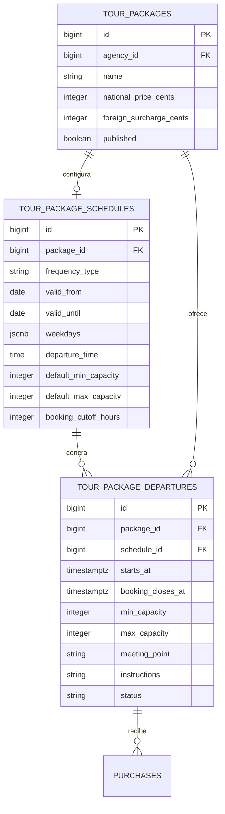

# Rediseño profesional de paquetes y salidas

## Objetivo

Permitir tres formas de programación sin mezclar la descripción comercial del paquete con las fechas que realmente se pueden comprar:

1. Salida única.
2. Salidas diarias.
3. Salidas en días específicos de la semana.

El paquete continuará siendo una plantilla con contenido, itinerario, fotografías, precio y política de cancelación. Cada fecha y hora disponible será una salida concreta con inventario propio.

## Hallazgos en Andaria

Andaria ya separa `paquetes_turisticos` de `paquete_salidas_habilitadas`, lo cual es una buena base. Sin embargo, la implementación mezcla responsabilidades:

- Solo admite `salida_diaria` y `salida_unica`; no existe la frecuencia por días seleccionados.
- La fecha fija, la hora y los cupos aparecen en la plantilla, aunque una salida también conserva fecha, cupos y logística.
- La pantalla de agencia indica que las salidas compartidas solo se crean manualmente, pero el servicio de compra todavía puede aceptar una fecha sin salida y materializarla durante la compra.
- Para la salida diaria, el turista puede elegir una fecha antes de que exista inventario concreto para ese día.
- La primera compra puede verse obligada a alcanzar por sí sola el cupo mínimo, contrario a la decisión de acumular compras pequeñas hasta la fecha límite.
- `hora_encuentro` termina funcionando parcialmente como hora de salida. Son conceptos distintos y deben almacenarse por separado.
- Los contadores de cupos existen tanto como configuración general del paquete como dentro de cada salida, sin una regla única para cambios posteriores.

La versión pequeña actual mantiene correctamente el paquete como plantilla, pero todavía no tiene programación ni salidas. Este es el momento adecuado para introducir la separación antes del módulo de compras.

## Modelo propuesto

### 1. Plantilla del paquete

Conserva nombre, descripción, duración, precios, política de cancelación, fotografías, itinerario, incluidos, excluidos y recomendaciones. No conserva una fecha fija ni disponibilidad consumible.

### 2. Regla de programación

La agencia configura una regla que sirve para generar salidas:

| Frecuencia | Datos necesarios | Resultado |
|---|---|---|
| Salida única | Fecha y hora | Una salida concreta |
| Salidas diarias | Desde, hasta y hora | Una salida por cada fecha del intervalo |
| Días específicos | Desde, hasta, días de semana y hora | Una salida en cada fecha coincidente |

El intervalo debe ser finito. Se recomienda limitar una generación a doce meses para evitar crear salidas indefinidas o demasiados registros por error.

La regla también define valores predeterminados de cupo mínimo, cupo máximo, anticipación de cierre, punto de encuentro e instrucciones. Esos valores se copian a cada salida para que después puedan modificarse individualmente sin alterar fechas ya vendidas.

### 3. Salida concreta

Es la unidad real que compra el turista. Contiene:

- Fecha y hora de inicio.
- Fecha y hora límite de compra.
- Cupo mínimo y máximo.
- Punto y hora de encuentro.
- Instrucciones para turistas.
- Estado operativo.
- Versión para evitar que dos operaciones sobrescriban cambios simultáneos.

El turista siempre selecciona un `departure_id`; nunca envía una fecha libre. Así se puede validar disponibilidad, cierre de ventas y concurrencia sobre una sola fila.

### 4. Cupos y mínimo de participantes

- Los cupos disponibles se calculan por salida: `máximo - retenidos - confirmados`.
- Varias compras pequeñas pueden acumularse.
- Solo los pagos confirmados cuentan para alcanzar el mínimo.
- Los cupos retenidos o con pago en revisión reducen la disponibilidad, pero no confirman que la salida alcanzó el mínimo.
- Si llega la fecha límite sin mínimo, la salida se cancela y se generan casos de reembolso para las compras afectadas.
- Un menor por debajo de la edad mínima se registra, pero no paga ni descuenta cupo, según la regla ya acordada.

## Estados recomendados

La salida usa estados persistidos sencillos:

- `draft`: todavía no visible ni comprable.
- `open`: acepta compras y aún no alcanzó el mínimo.
- `confirmed`: alcanzó el mínimo y continúa aceptando compras hasta el límite.
- `closed`: terminó el plazo de compra.
- `cancelled`: cancelada por la agencia o por no alcanzar el mínimo.
- `completed`: el servicio ya se realizó.

`sold_out` se muestra como condición calculada cuando los cupos disponibles llegan a cero; no necesita ser otro estado persistido.

## Flujo de la agencia

1. Completa información, tarifas, política, fotografías e itinerario.
2. Elige una de las tres frecuencias.
3. Define fechas, hora, cupos y anticipación de cierre.
4. Revisa una vista previa con el número de salidas y las primeras fechas que se crearán.
5. Guarda la programación y el sistema genera las salidas en una transacción.
6. Gestiona las salidas desde un calendario o lista y puede ajustar una salida concreta.

Una modificación de la programación solo debe regenerar salidas futuras sin compras. Las salidas con retenciones, pagos o compras confirmadas conservan su fecha, cupos y condiciones. Para ellas se requiere una modificación o cancelación individual con trazabilidad.

## Publicación y catálogo

La publicación de contenido y la disponibilidad son conceptos separados:

- `published` indica que la ficha del paquete está completa y puede mostrarse.
- `bookable` se calcula cuando existe al menos una salida futura abierta y con cupos.
- El catálogo muestra la próxima salida, las fechas disponibles y el cupo restante.
- La compra solo se habilita después de seleccionar una salida concreta.

Para esta versión se recomienda exigir al menos una salida futura para publicar por primera vez, evitando fichas públicas que no pueden comprarse.

## Cambios respecto al módulo actual

La implementación de plantilla, precios, fotografías e itinerario se conserva. El rediseño requiere:

1. Añadir programación y salidas mediante una migración nueva.
2. Incorporar las tres frecuencias en la interfaz de agencia.
3. Separar hora de salida de hora de encuentro.
4. Añadir una vista previa antes de generar salidas.
5. Publicar únicamente con disponibilidad futura, si se confirma esa regla.
6. Hacer que el futuro módulo de compras reciba siempre una salida, no una fecha libre.

## Decisiones confirmadas

- Días específicos significa días de la semana dentro de un intervalo.
- Una sola hora de salida por día en esta versión.
- Toda programación usa fecha inicial y final y admite como máximo doce meses.
- Una salida única debe tener una fecha futura para publicar. Las frecuencias recurrentes no exigen una salida creada manualmente.
- Los cambios solo regeneran salidas futuras sin compras ni retenciones.
- Cada salida tiene una ventana de compra: máxima anticipación en días y cierre en horas antes de partir. No se aceptan fechas libres ni pasadas.

## Referencias de producto

Sistemas de reservas consolidados aplican el mismo patrón: una oferta o producto separado de eventos de disponibilidad y sesiones concretas. Checkfront configura eventos únicos, continuos o semanales dentro de un intervalo y permite días de semana y horarios. Rezdy gestiona sesiones individuales o series y permite modificar una sesión, las siguientes o toda la serie.

- [Checkfront: recurrencia de eventos](https://support.checkfront.com/hc/en-us/articles/19868260869276-Creating-an-Item-Event-Classic-Items)
- [Checkfront: disponibilidad por fechas y días](https://support.checkfront.com/hc/en-us/articles/25089676400156-How-do-I-make-my-product-available-for-select-dates)
- [Rezdy: sesiones individuales y recurrentes](https://support.rezdy.com/hc/en-us/articles/19867807090716-How-to-Close-Availability-for-1-or-All-Sessions)
